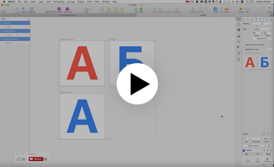

# Simple HTML Gallery generator

## How it works

It «converts» file structure with images to simple HTML page with styles.

<a href="https://youtu.be/wbgKVq7C7qw" target="_blank">
   
</a>

<a href="https://youtu.be/wbgKVq7C7qw" target="_blank">Watch on YouTube →</a>


## How to use

1. Download repository directly from github or:
```
git clone https://github.com/zmnv/zmnv-gg.git
```

2. Install packages:
```
npm install
```

3. Prepare image data. Place your images in `images/` folder. You can group they by subfolders.

4. Run app menu to start:

```
npm start
```
